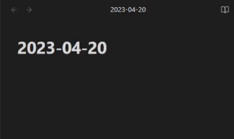

# Filename Template

Insert template based on filename of a new note, and also centralizes template settings into one script, making it easier to manage your templates accross various plugins.

Filename templates will help you by automatically populating the correct templates for daily or periodic notes that links to a future date, whenever you click on a non-existing note.

## Requirement

### Plugins

- [Templater](https://github.com/SilentVoid13/Templater)

## How to Use

1. Copy `main.md` to your vault's Templater template folder location.
2. Modify `main.md` to fit your needs:
    1. Modify `templateFolder` to the path of your template folder.
    2. Modify `noteTypes`, which consists of the [momentjs format](https://momentjs.com/docs/#/displaying/format/) for filenames, and their corresponding templates.

### Set as Default Template

Ever changed location of you template files, and have to change 5+ template settings? Not anymore.

1. Goto _Templater_ settings and find _Folder Templates_
2. Toggle _Enable Folder Templates_, and click _Add New_
3. Set _Folder_ to `/`, and _Template_ to `main.md`

`main.md` will be triggered when a new **empty** folder is created, and `main.md` will insert the appropriate template for the filename.

## Applications

If you need to use a specific template for a complex file path, such as `Project/yourProject/yourProject.md`, you can customize the code to detect it. This is not possible with the built-in Folder Templates feature of Templater.