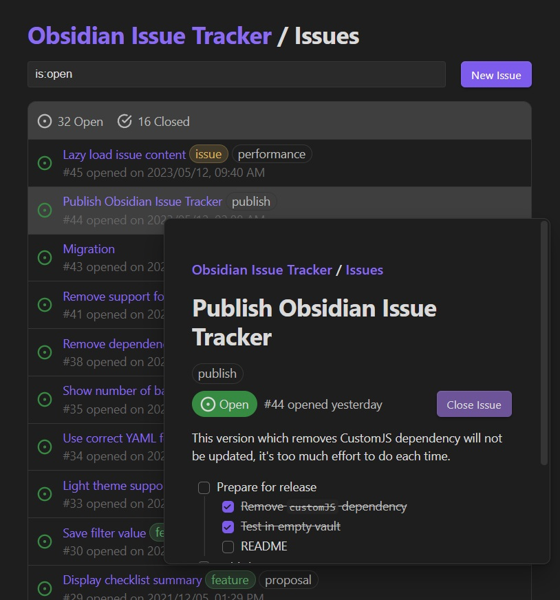

# Obsidian Issue Tracker

A Github-ish Issue Tracker in Obsidian.



## How does it work?

The script grabs issue notes from a subfolder by Dataview, then render it with [dv.view()](https://blacksmithgu.github.io/obsidian-dataview/api/code-reference/#dvviewpath-input).

Works best with the following file structure:

```sh
Project Name
├── issues
│   ├── issue-1.md   <--- dv.view("path/to/IssueTracker/issue", {...}) here
│   ├── ...
│   └── issue-n.md   <--- dv.view("path/to/IssueTracker/issue", {...}) here
├── Issue Tracker.md <--- dv.view("path/to/IssueTracker", {...}) here
└── Project Name.md
```

## How to use

1. Install plugins via _Community plugins_ tab.

- [Dataview](https://github.com/blacksmithgu/obsidian-dataview)
- [Templater](https://github.com/SilentVoid13/Templater)

2. Copy `IssueTracker/` to anywhere in your vault.
3. Optional - Copy contents of `templates/` to your Templater's template folder location, and modify `dv.view()`'s path argument.

That's it, you may now call `dv.view()`, or insert template to create an issue tracker.

## Options

You may pass arguments to `dv.view()` to change issue tracker's behavior.

```js
await dv.view("Issue Tracker/IssueTracker", {
    obsidian: obsidian,  // necessary, DO NOT REMOVE

    /** Options here */

    // Name of project, used as display text of project note's link
    // project_name: <your project name>

    // Title of project note, used to find the project note
    // project_note: <project note name>

    // Sub-folder where issue notes go
    // issue_folder: "issues/",

    // Template name, a template that exists in your templater folder
    // issue_template: "note.issue-tracker.issue.md",

    // Default query that shows up in the search bar
    // default_query: "is:open",
});
```

## Search Issues

Quick example: `is:open label:difficult title:sleep schedule "coffee addict"`

The query will search for issues that matches all of the following criteria:
- `is:open`: status is open
- `label:difficult`: has label "difficult"
- `title:sleep`: includes "sleep" in its title
- `schedule`: includes "schedule" in its title or content
- `"coffee addict"`: includes "coffee addict" in its title or content

### status

Issue status can only be `open` or `closed`, you can query them with `is` or `status`, `is:closed` and `status:closed` are essentially the same.

### label & title

Quotation marks can be used to preserve space, e.g., `label:"need help"`, `title:"blahaj support"`

## Examples

Two example projects are provided in [example](example/) folder. Try them out!

1. Download this repository: Goto the [repository page](https://github.com/ljavuras/obsidian-power-tools/tree/main), click `code` button on top right > click `Download ZIP`, or use `git clone`.
2. Unzip and open the repository as Obsidian vault.
3. Install Dataview and Templater.
4. Enable JavaScript Queries option in Dataview.
5. Set Template Folder Location to `Issue Tracker/templates` in Templater.


