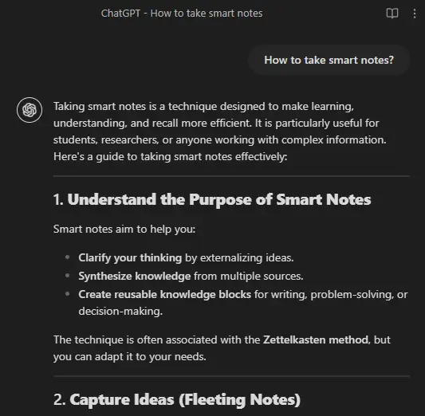

# ChatGPT Obsidian Web Clipper

*Clipped chat displayed in Obsidian.*

Clip ChatGPT conversations, and keep the look in Obsidian!

## Getting Started

1. [Import template](https://help.obsidian.md/web-clipper/templates#Import+and+export+Web+Clipper+templates) `clipper-chatgpt.json` to your Obsidian Web Clipper extension
2. Copy `callout-chatgpt.css` to `.obsidian/snippets` folder of your vault
3. Enable the style under `Settings > Appearance > CSS snippets`